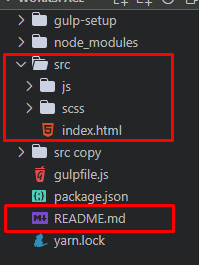

# Gulp Project Setup Version 0.1

There are lots of tutorial that you can find in the internet which makes it difficult to choose what's best for you, as for me, this is the final (for now) gulp setup that I created that works for me at the moment. I created this guide if ever I forget doing it or if someone find my setup beneficial to them. *It's better to have a backup* after all.

## 1. Prerequisite
---

* yarn.
* vscode terminal.

## 2. Plugin Installation
---

1. Inside of your project folder, open your terminal and type `yarn init -y` to generate a `package.json` file.

2. In your vscode terminal type/copy this command and press enter. (*see code below*)

```
yarn add -D gulp gulp-cli sass gulp-sass gulp-autoprefixer gulp-clean-css gulp-terser browser-sync stylelint stylelint-rscss gulp-jsdoc3 sassdoc bootstrap jquery @fortawesome/fontawesome-free@next gulp-babel babel-preset-env babel-core @babel/core @babel/preset-env babel-polyfill del
```

**Note:** this ends the installation part, you may proceed to the next section or if you want explanation about the plugins, feel free to read it.

1. we will add all of the plugins as dev dependencies.

> yarn add -D

2. this plugins are related to gulp.

> gulp gulp-cli sass gulp-sass gulp-autoprefixer gulp-clean-css gulp-terser browser-sync

3. setup vendors.

> bootstrap jquery @fortawesome/fontawesome-free@next

4. setup linters.

> stylelint stylelint-rscss

5. for documentation purposes.

> gulp-jsdoc3 sassdoc

6. setup babel.

> gulp-babel babel-preset-env babel-core @babel/core @babel/preset-env babel-polyfill

7. delete "dist" folder

> del

## 3. Project Folder Setup
---

follow this project's folder structure. (**create only the files that are within the red box**)



## 4. Gulp Configuration File
---

1. In your project's root directory, create a `gulpfile.js`.

2. In your gulpfile.js, copy and paste this code. (*see code below*)

```javascript
/**
 * import the required plugins
 */

const gulp = require("gulp");
const sass = require("gulp-sass")(require("sass"));
const prefix = require("gulp-autoprefixer");
const minify = require("gulp-clean-css");
const terser = require("gulp-terser");
const browserSync = require("browser-sync").create();
const sassdoc = require("sassdoc");
const jsdoc = require("gulp-jsdoc3");
const babel = require("gulp-babel");
const del = require("del");

/**
 * paths and configuration setup
 */

const paths = {
    bootstrap: {
        scss: "./node_modules/bootstrap/scss/bootstrap.scss",
        js: "./node_modules/bootstrap/dist/js/bootstrap.bundle.min.js"
    },
    fontawesome: {
        scss: "./node_modules/@fortawesome/fontawesome-free/scss/fontawesome.scss",
        js: "./node_modules/@fortawesome/fontawesome-free/js/all.min.js"
    },
    jquery: "./node_modules/jquery/dist/jquery.min.js",
    polyfill: "./node_modules/babel-polyfill/dist/polyfill.js",
    fonts: {
        entry: "./src/fonts/**/**.*",
        output: "./dist/fonts"
    },

    images: {
        entry: "./src/images/**/**.*",
        output: "./dist/images"
    },
    html: {
        entry: "./src/*.html",
        output: "./dist"
    },
    sass: {
        entry: "./src/scss/**/*.scss",
        output: "./dist/css"
    },
    css: {
        entry: "./dist/css/**/*.css",
        output: "./dist/css"
    },
    js: {
        entry: "./src/js/**/*.js",
        output: "./dist/js"
    },
    jsMinify: {
        entry: "./dist/js/**/*.js",
        output: "./dist/js"
    },
    docs: {
        sass: "./docs/sass",
        readme: "./README.md"
    }
};

const listOfStyles = [paths.bootstrap.scss, paths.fontawesome.scss, paths.sass.entry];
const listOfJSVendor = [paths.bootstrap.js, paths.fontawesome.js, paths.jquery, paths.polyfill];

const config = {
    browserList: {
        overrideBrowserslist: [
        "> 1%",
        "ie >= 8",
        "edge >= 15",
        "ie_mob >= 10",
        "ff >= 45",
        "chrome >= 45",
        "safari >= 7",
        "opera >= 23",
        "ios >= 7",
        "android >= 4",
        "bb >= 10"
    ]},
    babel: {
        presets: ["@babel/preset-env"]
    },
    browserSync: {
        server: {
            baseDir: "./dist",
            notify: false,
            open: false
        }        
    }
};

const sourcemap = {
    css: {
        enable: true,
        path: "./sourcemaps"
    },
    js: {
        enable: true,
        path: "./sourcemaps"
    }
};

/**
 * tasks for code development
 */

/** [1] compiles bootstrap and custom sass to css */
gulp.task("build:sass", function() {
    return gulp.src(listOfStyles)
        .pipe(sass().on("error", sass.logError))
        .pipe(prefix(config.browserList))
        .pipe(gulp.dest(paths.sass.output));
});

/** [2] compiles js vendors */
gulp.task("build:vendor", function() {
    return gulp.src(listOfJSVendor)
        .pipe(gulp.dest(paths.js.output));
});

/** [3] transforms custom js into es5 */
gulp.task("build:js", function() {
    return gulp.src(paths.js.entry)
      .pipe(babel({
        presets: ["@babel/preset-env"]
      }))
      .pipe(gulp.dest(paths.js.output));
});

/** [4] copies html from .src to .dist */
gulp.task("build:html", function() {
    return gulp.src(paths.html.entry)
        .pipe(gulp.dest(paths.html.output));
});

/** [4.1] copies html from .src to .dist */
gulp.task("build:images", function() {
    return gulp.src(paths.images.entry)
        .pipe(gulp.dest(paths.images.output));
});

/** [4.2] copies html from .src to .dist */
gulp.task("build:fonts", function() {
    return gulp.src(paths.fonts.entry)
        .pipe(gulp.dest(paths.fonts.output));
});

/** [5] starts live serve */
gulp.task("build:serve", function(cb) {
    browserSync.init(config.browserSync);
    cb();
});

/** [6] reloads the webpage */
gulp.task("build:reload", function(cb) {
    browserSync.reload();
    cb();
});

/** [7] watch task for ./src files */
gulp.task("build:watch", function() {
    gulp.watch(
        [paths.images.entry, paths.fonts.entry, paths.html.entry, paths.sass.entry, paths.js.entry],
        gulp.series(["build:images", "build:fonts", "build:html", "build:sass", "build:js", "build:reload"])
    );
});

/**
 * tasks for code deployment
 */

/** [1] minify css and generate a sourcemap */
gulp.task("prod:css", function() {
    return gulp.src(paths.css.entry, { sourcemaps: sourcemap.css.enable })
        .pipe(sass().on("error", sass.logError))
        .pipe(prefix(config.browserList))
        .pipe(minify())
        .pipe(gulp.dest(paths.css.output, { sourcemaps: sourcemap.css.path }));
});

/** [2] minify js and generate a sourcemap */
gulp.task("prod:js", function() {
    return gulp.src(paths.jsMinify.entry, { sourcemaps: sourcemap.js.enable })
        .pipe(terser())
        .pipe(gulp.dest(paths.jsMinify.output, { sourcemaps: sourcemap.js.path }));
});

/**
 * tasks for code documentation
 */

gulp.task("docs:sass", function() {
    return gulp.src(paths.sass.entry)
      .pipe(sassdoc({
        dest: paths.docs.sass
      }));
});

gulp.task("docs:js", function(cb) {
    gulp.src([paths.docs.readme, paths.js.entry], {read: false})
        .pipe(jsdoc(cb));
});

/**
 * task for deleting "dist" folder
 */

gulp.task("clean:dist", function() {
    return del.sync("./dist");
});
 
/**
 * console gulp commands
 */

/** [1] run "gulp" */
gulp.task("default", gulp.parallel(
    "build:images", "build:fonts", "build:html", "build:sass",
    "build:vendor", "build:js", "build:serve", "build:watch"
));

/** [2] run "gulp prod" */
gulp.task("prod", gulp.parallel(
    "prod:css", "prod:js"
));

/** [3] run "gulp sassdoc" */
gulp.task("sassdoc", gulp.parallel("docs:sass"));

/** [4] run "gulp jsdoc" */
gulp.task("jsdoc", gulp.parallel("docs:js"));
```

and that's it! you're done now, happy coding. 


